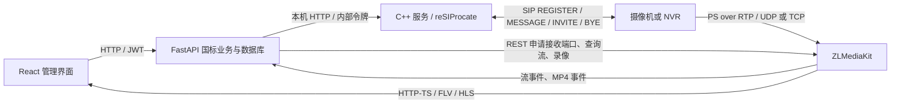
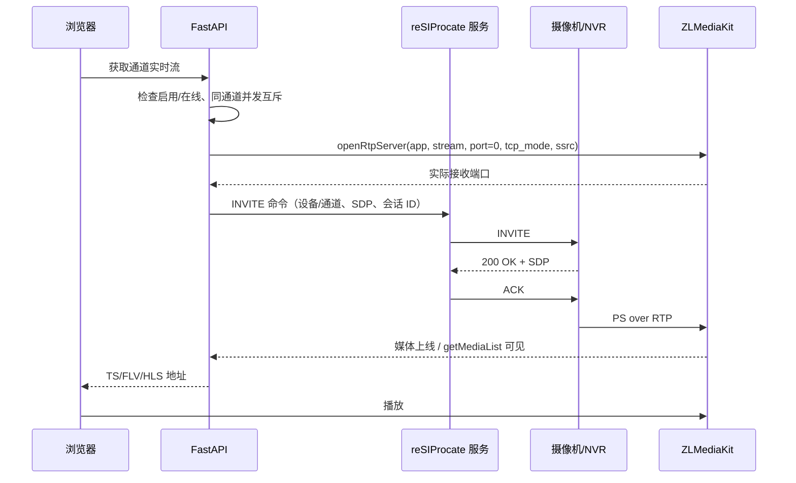

# GB/T 28181 一期接入设计与实施记录

更新日期：2026-09-11。本文同时记录组件选择、国标业务、接口约定、实施顺序和验收结果。实现状态以文末的验证记录为准，设计目标不代表已经通过真实设备验收。

## 1. 一期目标与范围

本平台作为接收摄像机/NVR 注册的国标平台，实现：预置设备凭据 → 注册鉴权 → 心跳在线 → 查询设备信息和目录 → 通道入库 → 实时点播 → 停止/断线清理。

- 以 GB/T 28181-2016 的基本接入流程为基线；2022 扩展需另行对照和设备联调，不能据此宣称全标准兼容或认证通过。
- SIP 支持 IPv4 UDP、TCP；媒体一期支持 RTP/UDP 和设备主动连接平台的 RTP/TCP（平台被动模式）。SIP 与媒体的传输选择独立。
- 验收先使用 H.264 视频、PS over RTP。H.265 浏览器解码、音频转码继续受现有播放链路约束。
- 保留现有 RTSP/ONVIF 设备、预览、平台本地 MP4 录像、抓拍和录像清理。
- 云台国标控制、设备端历史录像查询/回放/下载、语音对讲、告警订阅、向上级平台级联、跨 NAT 自动穿透及多实例高可用属于后续范围。

## 2. 组件分工与库的使用

### 2.1 reSIProcate

使用 C++ `resip` SIP 栈和 `rutil`，通过 `SipStack` 建立 UDP/TCP 监听、驱动 SIP 事务并收发消息。`Helper` 用于构造请求、响应、Digest challenge 和认证校验；SIP 消息使用库的头字段/Contents API，避免另写 SIP 报文解析器。

实际调用入口在 `native/gb28181/src/main.cpp`：

| 使用位置 | 库 API 与应用补充 |
| --- | --- |
| 服务启动与主循环 | `SipStack::addTransport(UDP/TCP)`、`process()`、`receive()`；业务状态和 SIP 发送在同一线程执行 |
| 注册鉴权 | `Helper::makeWWWChallenge()`、`authenticateRequest()`；应用绑定设备身份、Digest URI、有效期和来源，检查 qop nonce-count 防重放 |
| nonce | 扩展 `BasicNonceHelper`，将 nonce 绑定来源地址、端口和 TCP 连接；设备更换连接后重新 challenge，兼容无 qop 的旧式 Digest |
| MESSAGE / INVITE | `Helper::makeRequest()`、`PlainContents`、`sendTo()`；XML/SDP 由后端提供，TCP 复用已注册连接 |
| 对话结束 | `Helper::makeCancel()`；应用保存 tag、Contact、Route 构造 ACK/BYE，处理重复和迟到 200 |
| 接收正文 | 使用 `SipMessage::getRawBody()` 保留国标 XML/SDP 原文；不能让通用 SDP 解析器过滤国标的 `y=` 等扩展 |

本实现直接使用 SIP 栈，没有使用 DUM；因此上述注册和对话业务状态机由本服务负责。

本期服务围绕栈维护国标点播对话（Call-ID、双方 tag、CSeq、目标 Contact/Route、源连接、超时和结束状态），处理成功响应的 ACK、重复 200 OK、停止时的 CANCEL/BYE 和迟到响应。SIP 栈提供的事务重传不能替代这些应用层处理。

不构建 rePro 代理、reCon 媒体集成和 reTurn 服务；本方案不需要它们。reSIProcate 不会自动完成国标设备建模、MANSCDP XML、目录同步或 RTP 端口管理。

C++ 服务独立于 Python 进程。业务后端管理它的启动、健康检查、凭据下发和退出。内部 HTTP 只绑定回环地址、使用每次启动生成的令牌；令牌通过进程环境传入，不显示在页面或命令行。C++ 服务不直接访问业务 SQLite。

### 2.2 ZLMediaKit

继续负责 RTP 收包、PS 解封装、媒体轨道识别、协议转换和 MP4 录制，**不另行实现 RTP Server**。

- `openRtpServer`：先创建接收资源，获取实际端口；`port=0` 由 ZLM 分配。
- `getRtpInfo` / `getMediaList`：接收资源与已注册媒体是不同状态，不能把开端口成功当作可播放。
- `closeRtpServer`：结束点播或失败时回收接收资源，操作应幂等。
- `startRecord` / `stopRecord`：复用现有平台本地录像；国标录像不等于设备端录像检索。
- `on_stream_changed` / `on_record_mp4`：复用媒体和录像回调。

ZLM 必须编译开启 `ENABLE_RTPPROXY`，配置正确的媒体监听地址、端口范围、HTTP API 与回调。下发 SDP 的媒体 IP 必须是设备可达的实际地址，不能使用 `0.0.0.0` 或把 HTTP API 地址直接当作媒体地址。

### 2.3 FastAPI 与 React

FastAPI 持久化国标配置、认证设备和通道关系，解析/生成国标 XML 与 SDP，编排 SIP 和 RTP 资源，计算设备在线状态。React 提供国标接入页面、设备凭据维护、目录同步和通道预览，继续复用现有播放器。

## 3. 国标业务清单

| 业务 | 应用需要实现的内容 | 可复用的库能力 |
| --- | --- | --- |
| 平台配置 | 平台 20 位编码、域、SIP 监听/公告地址、端口、媒体公告地址、心跳与点播超时 | Pydantic 校验、AppSetting 持久化 |
| 设备凭据 | 预置设备 20 位编码、名称、独立密码、启停；拒绝未知设备注册 | 内部 HTTP 下发到 C++；密码不回传页面 |
| REGISTER | Digest 401/认证、设备身份绑定、Contact/源地址记录、有效期、续注册、注销 | reSIProcate Helper 和 SIP 事务 |
| Keepalive | 解析 MESSAGE 中 Notify/Keepalive、校验发送设备、更新最后心跳、超时离线 | SIP 栈收发；XML 在业务层处理 |
| DeviceInfo | 查询和解析设备名称、厂商、型号等基础信息 | MESSAGE + MANSCDP XML |
| Catalog | 主动查询、分批返回、SN 关联、去重、完整性判断、NVR 多通道映射 | MESSAGE + 安全 XML 解析 |
| 点播 | 通道检查、分配流/SSRC、申请 RTP、INVITE/SDP、ACK、等待媒体可用 | Helper / SipStack + ZLM |
| 停止 | 对话终止、端口回收、幂等重复停止、播放期间的录像保活 | CANCEL/BYE + closeRtpServer |
| 异常恢复 | SIP 拒绝、认证失败、无媒体超时、设备离线、服务退出、迟到响应 | 应用状态机、定时巡检和日志 |
| 页面 | 配置、设备注册状态、目录进度、通道管理与实时预览 | 现有 React/Ant Design/VideoPlayer |

## 4. 数据模型与现有系统兼容

新增国标专用表，不在旧 SQLite 的 `devices` 表上依赖 `create_all` 自动增列。

- `gb_devices`：注册设备；国标设备编码、显示名称、凭据、启停、注册有效期、最后心跳、来源、设备信息和目录同步进度。
- `gb_channels`：以 `(注册设备编码, 通道编码)` 唯一标识通道；保存目录状态、厂商、父节点、所属 Device ID、最后目录 SN 和是否仍在当前目录中。
- `gb_channels.record_paused`：保存手动暂停录像状态，防止关闭画面、后台巡检或媒体重连后擅自恢复录像。
- `gb_stream_sessions`：保存设备与会话 ID、SSRC、实际 RTP 端口和状态。先持久化分配意图，再调用 ZLM；清理失败保留记录供重试。
- 每个可播放通道映射为一个现有 `Device(access_type="gb28181")`，媒体继续采用 `app=<ZLM_APP>`、`stream=device_<Device.id>`，使列表、播放器和录像索引复用同一个 ID。
- 通道通过国标目录生成，普通设备创建接口不允许伪造国标通道或把已有 ONVIF 设备转换成国标设备。
- 注册设备状态与媒体状态分开：设备注册/心跳正常且目录通道可用，即使尚未点播也可显示在线；流是否在线仍通过 ZLM 判断。
- 目录未返回完整时保留旧通道；只有同一 SN 的完整目录收齐后才把缺失通道标记为不在目录中，不删除历史录像。
- 目录中的组织/区域节点不能无条件当作视频通道。无法确定类型的条目需保留可诊断信息，按编码类型筛选可点播通道。

## 5. 关键流程

### 5.1 注册与状态

1. 管理员配置平台、预置设备编码和密码。
2. 摄像机/NVR 配置平台 SIP 编码、域、IP、端口和对应凭据，发送 REGISTER。
3. C++ 服务发 401 challenge；设备携带 Authorization 重发。
4. 绑定 Digest username、From/To 设备身份和预置设备，校验 nonce 有效期与认证；成功后回复 200 并登记来源/有效期。
5. FastAPI 消费注册事件并自动发起 DeviceInfo、Catalog 查询；认证信息不写入普通日志。
6. 正常 Keepalive 更新业务心跳；到达心跳超时、注册失效、注销或服务丢失时显示离线并清理媒体。

### 5.2 目录同步

1. 生成 SN，在数据库记录本轮目录查询状态，然后发送 Catalog Query。
2. 接收 Response/Catalog：校验发送注册设备、XML DeviceID、SN、SumNum 和条目数量。
3. 支持多条 MESSAGE 分批返回；按唯一通道编码去重，处理 UTF-8 和 GB2312/GBK 编码。
4. 收齐后原子完成目录状态更新；重复和迟到响应不重复建通道、不覆盖新一轮同步。
5. 不完整/超时目录显示错误并允许重新同步，不据此删除旧通道。

### 5.3 实时点播

SDP 至少包括合法的 `o=`、`s=Play`、设备可达的 `c=`、`t=0 0`、`m=video`、`a=recvonly`、`a=rtpmap:96 PS/90000` 和国标 `y=` SSRC。TCP 被动接收增加 `TCP/RTP/AVP`、`a=setup:passive` 和 `a=connection:new`。检查响应拒绝媒体或协商不匹配的情况。

同一通道点播申请必须互斥、重复启动复用会话；SSRC 与会话关联而非拿数据库 ID 直接代替。INVITE 成功与媒体到达分别计时，任何阶段失败都必须释放 RTP 资源。

### 5.4 停止与录像

- 已建立对话：BYE 后回收 RTP 接收资源；未建立对话：CANCEL，并处理取消后迟到的 200 OK（ACK 后 BYE）。
- 播放停止不能误停其他观看者或正在进行的录像。国标预览使用后端带过期时间的播放租约，浏览器定期续约；租约归零且无录像需求才停止。
- 设备关闭/禁用或显式服务停用可强制结束；媒体空闲、异常退出、过期租约由后台巡检清理。
- 本地录像沿用设备录像开关；国标媒体上线后启动 MP4，录像需求保持会话，关闭开关停止录像。手动停止不应立即被周期任务无条件重新启动。

### 5.5 服务生命周期与事件可靠性

- 默认关闭国标功能；未配置设备可达地址或未构建 C++ 程序时，不伪报启动成功。
- 单个 FastAPI 实例管理一个 C++ 服务；内部监听端口冲突时报告错误，不终止不属于本项目的进程。
- 事件有递增序号和服务实例标识。FastAPI 成功处理后才推进游标；可检测事件缓冲溢出和服务重启，触发重新注册/目录同步，不静默跳过。
- 服务关闭先终止点播并清理 RTP，再退出 C++ 进程。异常重启时回收已知旧会话并把设备恢复为待注册，后续心跳/注册驱动恢复。
- 开发 reload 和正式打包采用同一后端生命周期，不支持同时运行多个带国标控制权的 worker。

## 6. 接口约定

### 6.1 对前端的业务接口

全部要求已有 JWT；国标配置和凭据写操作要求管理员。

| 接口 | 用途 |
| --- | --- |
| GET/PUT `/api/gb28181/config` | 读取/保存平台配置和运行状态 |
| GET/POST `/api/gb28181/devices` | 列出/预置注册设备（输出不含密码） |
| PUT `/api/gb28181/devices/{id}` | 修改名称、密码、启停 |
| POST `/api/gb28181/devices/{id}/catalog` | 发起目录同步 |
| GET `/api/gb28181/devices/{id}/channels` | 查看发现的通道与播放设备 ID |
| POST `/api/streams/{id}/lease` | 获取/续约国标播放租约并启动媒体 |
| DELETE `/api/streams/{id}/lease/{lease_id}` | 释放当前观看者租约 |

预览、协议地址、录像和抓拍仍使用现有 `/api/streams` 和 `/api/recordings`；无法提供的国标 PTZ 能力应明确返回不支持，不能回退 ONVIF。

国标的 `GET /api/streams/{id}` 和 `GET /api/streams/{id}/protocols` 只查询状态/地址，不自动点播。外部客户端需要申请播放租约或启用录像才能保持媒体会话。租约成功返回后有效期为 45 秒，前端每 15 秒续约；慢速 SIP/媒体协商不会扣掉返回后的租约时间。`POST /api/streams/{id}/start` 对国标设备也返回租约，调用方须按相同规则续约和释放。

### 6.2 C++ 内部接口

仅回环 HTTP，使用 `Authorization: Bearer <内部令牌>`，不暴露给浏览器。

| 接口 | 用途 |
| --- | --- |
| GET `/health` | 服务版本、实例标识、监听状态 |
| PUT `/v1/devices` | 完整替换已授权设备及凭据，禁用时移除注册/对话 |
| GET `/v1/events?after=` | 有界事件批次、最新序号、溢出检测 |
| POST `/v1/message` | 向已注册设备发送国标 XML（原始正文按 Base64 传输） |
| POST `/v1/invite` | 向通道发起点播并返回 SIP Call-ID |
| DELETE `/v1/sessions/{id}` | 幂等终止会话 |
| POST `/v1/shutdown` | 受控退出 |

## 7. 实施顺序与验收

1. 文档、固定版本依赖、最小 C++ 可编译服务。
2. 注册/鉴权与事件接口，真实 UDP/TCP 报文验证。
3. 后端配置、设备/通道表、目录 XML 与状态管理。
4. RTP API、SDP、点播状态机、播放租约与清理。
5. 管理页面、现有预览/录像兼容、Windows 启停与打包。
6. 自动测试与模拟设备联调；具备真实设备后按下表验收。

| 验证场景 | 必须观察到的结果 |
| --- | --- |
| 错误密码/未知设备/伪造身份 | 注册被拒绝，不产生在线设备 |
| 正常注册、续注册、注销 | 认证正确、有效期正确、注销离线 |
| UDP 与 TCP SIP | 分别注册和发送 MESSAGE；响应/请求走正确地址或连接 |
| 心跳中断/注册到期 | 在配置窗口内离线并清理会话 |
| NVR 多通道、分批/重复/乱序目录 | 正确建通道，无重复、不误删旧通道 |
| GB2312 中文与恶意/超大 XML | 中文正常；非法输入拒绝且服务继续运行 |
| 点播、反复停止/重开 | 可播放、同通道会话复用、端口不泄漏 |
| INVITE 拒绝、无 RTP、迟到 200 | 返回可理解错误并释放资源 |
| 多窗口/多客户端、页面退出 | 不互相误停，过期观看租约可回收 |
| 录像开关与媒体重连 | 开关生效、历史索引保留、录像期间不误停 |
| 后端/信令服务重启 | 状态恢复为待注册、旧会话被清理、能再次接入 |
| 原有 RTSP/ONVIF | 原测试和前端构建通过，功能不回退 |

## 8. 构建、部署与参考

### 8.1 编译与依赖

Windows 使用 Visual Studio 2022（C++ 桌面开发 / x64）、CMake 3.24+。在仓库根目录执行：

~~~powershell
powershell -NoProfile -ExecutionPolicy Bypass -File .\native\gb28181\build.ps1
~~~

第一次构建联网获取以下固定依赖，CMake 校验归档 SHA-256：

| 依赖 | 固定版本 |
| --- | --- |
| reSIProcate | 1.14.0 / commit `632e215c2ca9aee5416bfe1808851ea6fa380044` |
| nlohmann/json | 3.11.3 |
| cpp-httplib | 0.18.6 |

产物为 `native/gb28181/build/bin/Release/gb28181-sip.exe`；许可文本在 `native/gb28181/build/licenses/`。依赖缓存 `.deps/` 和构建目录不入库。运行时静态链接 SIP 依赖，不需要另装 reSIProcate；FastAPI 负责启动该程序，不需要用户手动常驻一个 SIP 进程。

现有 `packaging/package_windows.ps1` 已接入 C++ 构建，并复制 SIP 程序、依赖许可及本文到安装包目录。打包环境因此新增 CMake / VS2022 C++ 要求；目标机沿用原安装包运行方式。

### 8.2 后端与媒体配置

平台编码、域、公告地址、超时和媒体模式在“国标接入 → 平台配置”保存到数据库，默认关闭。以下环境变量属于内部服务配置：

| 变量 | 默认 / 含义 |
| --- | --- |
| `GB28181_BINARY` | 空时自动寻找开发构建产物；安装包寻找 `gb28181/gb28181-sip.exe` |
| `GB28181_HTTP_PORT` | `18081`，仅绑定 `127.0.0.1` 的内部控制端口 |
| `GB28181_RUNTIME_DIR` | `./data/gb28181`，保存运行配置和 `sip-service.log`，相对于后端工作目录 |
| `ZLM_API_BASE` / `ZLM_API_SECRET` | 沿用现有 ZLM HTTP API 地址和密钥 |
| `ZLM_APP` | 默认 `live`；国标 RTP API、录像和播放地址使用同一 app |

ZLM 编译须开启 `ENABLE_RTPPROXY`，录像须开启 `ENABLE_MP4`。将仓库 `config/zlmediakit.config.ini` 的相关项合并到实际运行配置并重启 ZLM 后生效；已有设备运行时应安排维护窗口，不能只修改模板就认为服务已应用。关键项为：

~~~ini
[rtp_proxy]
port=0
port_range=30000-35000
timeoutSec=150
ps_pt=96
~~~

保持 HTTP-TS/RTSP/RTMP 等输出开启、全局 `protocol.enable_mp4=0`，由后端按设备录像需求启停。国标接收使用 `only_track=2`，一期只处理视频轨。`on_stream_changed`、`on_record_mp4` 必须指向实际后端；媒体 API 成功并不能代替录像回调成功。

网络放行按实际部署设置：

- SIP 默认 `5060/UDP` 和 `5060/TCP`；两种信令传输同时监听。
- ZLM 配置的 RTP 端口范围；UDP 使用 RTP/RTCP 成对端口，TCP 被动模式要求设备能主动连入 ZLM 分配的端口。现场防火墙须覆盖配对的 RTCP 端口。
- 浏览器可达的 ZLM HTTP 输出端口（模板为 `8080/TCP`）、后端 HTTP 端口；内部 `18081` 无需对外开放。
- 公告 IP 和媒体 IP 分别填设备可达的 SIP 主机和 ZLM 主机地址；两者可以不同，均不能填 `0.0.0.0`。

仅支持一个后端进程管理这套国标控制面，不要用多个 Uvicorn worker 或多个后端同时控制同一 ZLM app / stream 名空间。数据库包含设备注册密码，按现有设备凭据存储方式保存于本地，API 响应不返回密码。

### 8.3 第一次接入

1. 编译 SIP 服务，准备已启用 RTP 能力的 ZLM；按项目 README 启动后端和前端。
2. 用管理员进入“国标接入 → 平台配置”，填写 20 位平台编码、10 位域、SIP 地址/端口和媒体地址。选择媒体 UDP 或 TCP 被动模式并启用；此模式当前对全平台生效。
3. 在“注册设备与通道”预置摄像机/NVR 的 20 位设备编码、名称和独立注册密码。
4. 在设备国标设置中填写相同的平台编码、域、SIP 地址/端口及设备编码/密码。设备可以选择 SIP UDP 或 SIP TCP；它与第 2 步的媒体传输模式相互独立。
5. 注册后等待自动查询 DeviceInfo 和 Catalog。目录完整后选择视频通道“实时预览”；也可在设备管理中编辑通道名称、启停和录像开关。
6. 关闭预览释放本页租约；存在其他观看者或录像需求时继续收流。手动停止录像会持久保存暂停状态，点击“开始录像”或明确重新打开设备录像开关后恢复。

修改平台配置会重启信令服务并结束当前国标点播，设备需重新注册；暂停的录像不会因重连而自动恢复。

### 8.4 排查入口

| 现象 | 首先核对 |
| --- | --- |
| 服务无法启动 | 页面错误、C++ 产物路径、SIP/内部 HTTP 端口占用、`sip-service.log` |
| 一直待注册 | 编码、域、密码、SIP 可达性；注册绑定设备来源，更换连接后必须重新认证 |
| 注册在线但目录不完整 | 设备错误信息、目录 SN / SumNum、分批数量；旧通道不会因未收齐而被删除 |
| INVITE 成功但无画面 | SDP 中媒体 IP / 实际接收端口、设备媒体传输模式、H.264/PS 编码、ZLM RTP 支持 |
| 有媒体但无录像索引 | 通道录像开关、手动暂停状态、ZLM MP4 支持/磁盘路径、分片时长和回调地址 |
| 关闭画面后仍收流 | 其他观看租约、本地录像需求；意外断网的浏览器租约会过期回收 |

### 8.5 参考

- reSIProcate 官方说明：https://github.com/resiprocate/resiprocate
- SIP 栈 API：`resip/stack/SipStack.hxx`、`Helper.hxx`。
- 本地 ZLM API：`backend/ZLMediaKit/server/WebApi.cpp` 中 `openRtpServer`、`closeRtpServer`。
- 本地 ZLM 配置：`backend/ZLMediaKit/conf/config.ini` 中 `[rtp_proxy]`。

## 9. 实施与验证记录

2026-09-11：一期代码已落地，包括原生 SIP 服务、后端设备/目录/媒体业务、管理页面、播放租约、录像联动和打包接入。

| 验证层 | 结果 / 覆盖 |
| --- | --- |
| Windows C++ 构建 | VS2022 x64 Release 编译通过；许可文件随构建生成 |
| 原生 SIP 报文 | 7 项通过：UDP/TCP 注册、错误凭据、重放拒绝、旧式 Digest 续注册、来源变更、MESSAGE、INVITE/ACK/BYE、CANCEL 后迟到 200、注册到期、内部鉴权 |
| 后端 | 全套 46 项通过，其中 20 项国标测试；覆盖目录批次/缺失保留、权限与凭据输出、并发租约、慢出流、无 RTP、清理重试、心跳、重启、录像并发与暂停、数据库异常恢复；其他 26 项为原有业务回归 |
| 实际媒体链路 | 2 项通过：真实 FastAPI + 已编译 reSIProcate + 独立 ZLM，分别使用 SIP/TCP＋RTP/TCP、SIP/UDP＋RTP/UDP；模拟 NVR 上报中文目录并发送合成 H.264 / MPEG-2 PS over RTP |
| 媒体验证内容 | TS 同步字节与实际数据、FLV 头、MP4 分片回调入库及文件读取；每条链路两次点播、两次 BYE，停止后 RTP 接收资源为零；录像保活、手动暂停和 SIP 在线状态分离均通过 |
| 前端 | `npm run build` 通过；存在构建工具原有的包体积提示 |

测试命令（仓库根目录）：

~~~powershell
# 原生 SIP 真实报文测试
.\backend\venv\Scripts\python.exe -m unittest discover -s native\gb28181\tests -p test_sip_service.py -v

# 后端全套回归
Push-Location backend
.\venv\Scripts\python.exe -m unittest discover -s tests -v
Pop-Location

# 前端生产构建
Push-Location frontend
npm run build
Pop-Location

# 可选：独立进程的实际媒体联调，使用安装了后端依赖的 Python
$env:GB28181_RUN_MEDIA_TESTS='1'
$env:GB28181_TEST_FFMPEG='C:\tools\ffmpeg\bin\ffmpeg.exe'
# ZLM 不在仓库约定位置时再设置 GB28181_TEST_ZLM
.\backend\venv\Scripts\python.exe -m unittest discover -s native\gb28181\tests -p test_media_pipeline.py -v
Remove-Item Env:\GB28181_RUN_MEDIA_TESTS
~~~

媒体测试中的 FFmpeg 只用于生成合成视频；生产国标接收/播放不依赖 FFmpeg 转码。测试创建临时数据库、随机 SIP/HTTP 端口和独立 ZLM 进程；RTP 测试范围为 `39000–39998`。失败日志留在 `native/gb28181/build/media-test-*`，成功后清理临时资源。合成 PS 使用 MPEG-2 PES 时间戳；MPEG-1 PS 不能替代本次国标媒体验收素材。

本次尚未完成：物理摄像机/NVR 兼容性联调、浏览器手工播放验收、长时间稳定性/容量测试，以及重新生成完整安装程序。打包脚本已接入并核验构建步骤，不等于安装包部署验收。接入真机时按第 7 节逐项记录厂家/型号/固件、SIP/RTP 组合、编码、抓包及故障恢复结果。

## 10. 代码定位

| 位置 | 职责 |
| --- | --- |
| `native/gb28181/src/main.cpp` | SIP 栈、认证、注册、对话、内部 HTTP 与事件队列 |
| `native/gb28181/CMakeLists.txt` / `build.ps1` | 固定依赖、编译、许可归档 |
| `backend/app/models/gb28181.py` | 注册设备、目录通道和媒体会话表 |
| `backend/app/schemas/gb28181.py` | 平台配置、设备输入/输出与租约校验 |
| `backend/app/services/gb_protocol.py` | XML、目录条目、SSRC、SDP |
| `backend/app/services/gb_catalog.py` | 配置持久化、目录批次应用、注册在线计算 |
| `backend/app/services/gb_gateway.py` | C++ 子进程和本机控制客户端 |
| `backend/app/services/gb_runtime.py` | 事件、点播、租约、录像、清理和恢复 |
| `backend/app/api/gb28181.py` | 国标配置/预置设备/目录 API |
| `backend/app/adapters/gb28181.py` | 国标适配器边界，避免错误回退 ONVIF |
| `frontend/src/pages/Gb28181.tsx` | 国标平台配置、注册设备和通道页面 |
| `frontend/src/hooks/useGbPlayback.ts` | 可见通道的租约获取、续期、释放 |
| `backend/tests/test_gb28181.py` | 后端协议/业务回归 |
| `native/gb28181/tests/` | 实际 SIP 报文、独立进程媒体链路测试 |
